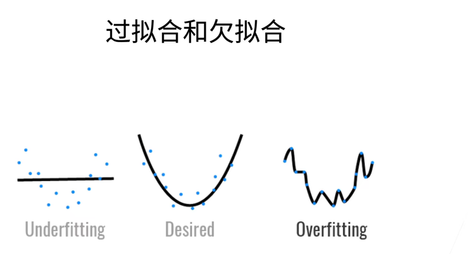

# 1.损失函数

损失函数就是我们神经网络需要优化的目标函数，举个最简单的例子就是我们的线性拟合过程。我们需要让我们得到的直线函数尽可能地经过所有的点，也就是让所有点距离我们的直线更近，化成数学的语言也就是：

$$E(θ)=\sum_{i=1}^n(y_i−f(x_i,θ))^2$$

而这个就是线性拟合的误差函数了。而在机器学习领域，我们称之为损失函数(loss function)。所以，其实损失函数就是一个需要优化的目标函数，我们要做的就是通过调节参数，网络结构等让损失函数的值尽可能降低，得到更好的结果。

# 2.反向传播算法(BP)

反向传播算法可以说是现代神经网络的核心，现代神经网络就主要运用反向传播算法来优化网络中的参数。

## （1）梯度下降

我们上面讲了损失函数，我举的例子可能有点太简单了，因为现代的神经网络的层数是非常深的，我们不可能直接用一个函数就可以表示输入与输出之间的关系，也不可能直接写出输入与输出之间的误差函数。你可以把我们的误差函数想象成这个样子： 

$$y=f(u) \rightarrow u=g(v) \rightarrow v=h(o) ....... k=p(x)$$

其中 $y$ 就是损失函数的结果，$x$ 就是我们的输入。

显然这是一个非常复杂的函数，它嵌套了多层的函数，并且每个函数内部都有许多的可调节的参数。

那么我们的目标是降低 loss ,那么我们该怎么调节参数，使得 loss 降低呢?

我们知道，我们高中求极值的方法就是寻找导数为 0 的点，现在，我们依旧采取这个思路。可是，我们一开始可能处在一个还是很高的点上，现在我们想要从这个很高的点上到达最低的地方，我们有多个方向可以走（因为我们是多维的），那么我们该往哪个方向走呢？

显然，我们应该往这个点的负梯度方向走。那么，我们该怎么求这个点的梯度方向呢？也很简单，只需要对我们的每个变量进行微分，就可以得到梯度的方向了（对的，梯度是一个向量）。然后，我们只需要向着梯度的方向走一段距离就可以了。

而对于嵌套函数的微分相比不需要我说什么了，核心就是**链式法则**，只不过因为嵌套的层数确实有点多，有可能会算蒙。

## （2）学习率

我们知道了梯度下降的基本原理了，但是你看了之后应该还有一个问题，就是“你说这一段距离，那改走多远的距离呢？”

我们可以走一个梯度的距离，也可以走半个梯度的距离等等。我们这时引入了另一个参数，学习率 $\alpha$ ，学习率主要控制我们梯度下降的距离。我们假设得到的梯度为 $Y$ ，那么我们最后走的距离也就是 $\alpha Y$ 。

对于学习率，我们不可以设置地太大，这样子可能会导致移动的步伐太大，模型的损失值一直震荡，没有办法收敛。但是我们也不能设置地太小，如果设置得太小就有可能会导致收敛速度过慢，或者收敛到了一个较高的点上。

## （3）算法流程

现在，我们就可以开始讲解反向传播的算法流程了。

我们设置好了一个网络结构后

1、我们从输入层开始，输入会经过许多的神经元组成的层，最后会到达输出层，最后被输出。这个从输入层到输出层的过程叫做向前传播（forward）。

2、我们到达输出层后，通过损失函数从输出层向输入层的方向通过梯度下降或者其他优化算法来计算每一层的误差梯度。实现对网络中参数的更新。

# 3.常见问题

## （1）梯度消失

我们上面讲过，我们的模型是通过反向传播算法来实现。我们下面举个简单的例子解释为什么会出现梯度消失的问题：

如上所示是一个具有三个隐藏层的神经网络，那么其中距离输出层最远的那一层的参数也就最有可能出现梯度消失的问题。我们如下图所示，举一个简单的深层神经网络。我们假设经过线性运算后，通过的激活函数为 sigmod 函数。

我们现在想要对$b_1$ 求微分，按照链式法则，就应该是以下公式：~~（确实有一点点复杂）~~

$$\frac{\partial C}{\partial b_1} = \frac{\partial C}{\partial y_4} \frac{\partial y_4}{\partial z_4} \frac{\partial z_4}{\partial x_4} \frac{\partial x_4}{\partial z_3} \frac{\partial z_3}{\partial x_3} \frac{\partial x_3}{\partial z_2} \frac{\partial z_2}{\partial x_2} \frac{\partial x_2}{\partial z_1} \frac{\partial z_1}{\partial b_1}  
= \frac{\partial C}{\partial y_4} \sigma'(z_4) w_4 \sigma'(z_3) w_3 \sigma'(z_2) w_2 \sigma'(z_1) (2)$$

其中 $\sigma'(z_i) $ 表示对 sigmod 函数求导。我们可以得到 sigmod 的导数应为:

$$y'={e^{-x} \over (1+e^{-x})^2}$$

我们通过相关的计算就可以得到其导数最大值也只有 $1\over 4$ 。所以，在其他 $w_i$ 的值都较小的情况下，我们求出的结果应该是多个很小的数字相乘，最后也是一个很小的数字。所以，我们对于 $b_1$ 的更新可以说是很小，甚至是微乎其微的，这就导致**浅层的网络参数更新缓慢甚至停滞**。这也就是深层网络经常会出现的梯度消失问题了。（之后会有残差网络来解决这个问题）

## （2）梯度爆炸

了解了梯度消失后，梯度爆炸的定义我们就能很快的理解了。

我们对于浅层网络求微分后，如果得到的是多个数相乘的情况下，这多个数很多都大于 1，那么我们相乘得到的结果就会很大很大，那么就会导致浅层网络的梯度会很大，进而导致参数的震荡。而这种现象就是**梯度爆炸**。

## （3）过拟合和欠拟合

现在，我们知道了，神经网络就是一个通过我们输入的数据，去调整参数，直到损失函数降低到很小的一个函数。那么，我们想一想如下的情况，你会觉得那种函数拟合的效果更好呢？

=======
​	我们一开始看可能觉得第三个很好，但是好像又有点奇怪。其实，第三个的情况就是我们的过拟合（overfitting）的情况，我们可以发现，网络的参数拟合的太好了，以至于把我们输入的噪声也学会了。这就像是一个拼命刷题的学生，他把他刷过的题目都死记硬背了下来，但是一到考试的时候，题目有一点点的变化他就不会了。而这种情况就是模型过拟合了。

​	而对于第一个图的情况，我们一看就知道函数拟合的不好，并没有学习到数据分布的规律，其对应的输出肯定也是不好的。这就是一个不学习，没有做过的题的学生，他在平时表现就不好，到考试依旧表现不好。而这种情况就是欠拟合（underfitting）了。

​	过拟合就是在训练集上准确率良好，但是到测试集准确率就迅速下降。

​	欠拟合就是在训练集和测试集上都表现的很差。

那到底有什么原因未导致这两种情况呢？

先说说**欠拟合**：

- **模型过于简单**：模型结构无法捕捉数据中的复杂关系。
- **训练时间不足**：模型还没有充分学习到数据中的模式。
- **特征不足**：输入特征太少，导致模型无法充分学习。

再说说**过拟合**：

- **模型过于复杂**：参数过多，导致模型能够记住每一个训练数据点。
- **训练数据量过少**：数据不足以代表真实情况。
- **特征过多且无正则化**：大量不相关的特征增加了模型复杂度

了解了原因后，要解决这两个问题就很简单了。对于**欠拟合**：

- **增加模型复杂度**：通过增加模型的复杂度，可以帮助模型更好地拟合数据。例如，在神经网络中增加隐藏层或神经元的数量。
- **训练更长时间**：在深度学习中，欠拟合通常意味着模型还没有充分学习。可以通过增加训练的轮数来改善欠拟合。
- **增加特征**：通过引入更多有意义的特征，可以帮助模型更好地学习数据中的模式。例如，特征工程中的特征生成步骤可以生成多项式或交互特征。

而对于**过拟合**，我们可以：

- **降低模型复杂度**：简化模型，比如减少神经网络层数或多项式的阶数。
- **进行数据增强**：在图像分类任务中，通过旋转、裁剪、翻转等方法增加数据的多样性，提升模型的泛化能力。
- **引入正则化**：正则化通过惩罚模型的复杂度，让模型不容易“过拟合”。

其中让我先解释一下什么是正则化：

我们假设原来的损失函数为 $loss$ ,那么使用 **$L_1$正则化**后的损失函数 $real\_loss$ 就为：

$$real\_loss=loss-\sum_i |w_i|$$

其中 $w_i$ 就是每一层神经网络的权重。可以看出，如果过拟合使得某些权重发挥了过大的功能，那么正则化通过在损失函数中添加权重的惩罚，使得权重不能变化过大，进而减少过拟合的可能。

还有一种正则化称为 **$L_2$ 正则化**，它的公式与 $L_1$ 正则化相似，如下所示:

$$real\_loss=loss-\sum_i {w_i}^2$$

他发挥的功能与 $L_1$ 正则化相同，只不过惩罚力度更强。

至于为什么要叫 $L_1$ 以及 $L_2$ 正则化，是因为 $\sum_i |w_i|$ 是绝对值之和，称为 **$L_1$ 范数**，而 $\sum_i {w_i}^2$ 是平方之和，称为 **$L_2$ 范数**。

还有一种方法是使用**丢弃法（dropout）**

丢弃法可以看成是一种正则化，它的公式如下所示：

$$x_i'=
\begin{cases}
0 \quad p概率 \\
{x_i \over 1-p}  \quad 1-p概率
\end{cases}$$

可以看到，我们就是以 $p$ 的概率丢弃了一些神经元的输出。但是丢弃后的结果依旧可以保证无偏,因为:

$$E(x_i')=0\times p + (1-p) \times {x_i \over 1-p} = x_i$$

可以看到期望依旧为 $x_i$，所以依旧无偏。

对于正则化，它的目标就是为了解决过拟合，不让权重过大。丢弃法可以理解为在层之间加入噪声，让权重都具有重要性，所以可以起到正则化作用。

总结：

- 丢弃法将一些输出项随机置0来控制模型复杂度
- 常作用在多层感知机的隐藏层输出上
- 丢弃概率是控制模型复杂度的超参数

注意：**正则化的方法只是在训练的时候用到，影响所有权重，而不会在推理的时候用到！**

------

## （4）解决梯度问题

- **使用合适的初始化方式**。初始化方式一般有三种：

​			1.预训练初始化：例如将一个已经在很大数据集上训练好的模型直接拿过来，将里面的参数作为初始参数。一般认为在大数据集上训练过后的模型就有较强的泛化能力。

​			2.随机初始化

​			3.固定初始化

- 换用**ReLU**、**LeakyReLU**、**ELU**等激活函数

ReLU: 可以使得导数恒为1，但是小于 0 的范围导数为0，可能导致一些神经元没法激活。

LeakyReLU：解决了ReLU中 0 区间带来的影响。

ELU：和LeakyReLU一样，都是为了解决0区间问题，相对于来，ELU计算更耗时一些

- 采用**BatchNorm**

BatchNorm就是将神经元的输出都拉到均值为0，方差为 1 的正态分布中

**防止梯度下降原理**：因为在均值为0，方差为 1 的正态分布区间中，激活函数的变化较为敏感，也就是输入一个小变化就可能会导致梯度的变化较大，从而引起损失函数变化较大。

**防止梯度爆炸原理**：正则化后的输入值所在区域的梯度小于1。

- **梯度裁剪和正则化**

正则化在之前已经讲过，主要来介绍一下梯度裁剪。

如果一个梯度向量十分得长，那么就有可能会引起梯度爆炸的问题，我们设这个梯度向量为 $g$ ,那么梯度裁剪的操作可以表示为:

$$g \leftarrow min(1, {θ \over ||g||})g$$

也就是我们要求裁剪过后的向量的范数不能超过 $θ$ ,这样就可以防止梯度爆炸

-  **残差结构与LSTM**可以有效防止**梯度消失**

二者的原理相同，以残差网络为例，残差网络中会存在许多跨层连接，例如：

其中跨层连接就提供了无损的梯度连接，这样就可以很好得防止梯度消失

# 4.SoftMax 回归

## （1）基本

现在想一想看，我们如果想要区分一幅图片上描绘的动物是猫，狗还是鸡，我们该怎么描述这个问题呢？对于区分类别这种问题，他想要得到的问题答案应该是一个“硬性”的答案，而不是一个“软性”的答案。也就是我们不希望最后得到的是一个这样的回答：“我觉得这幅图片三分像猫，三分像狗，四分像鸡”，而是一个确切的猫，狗还是鸡的类别。

这种分类的问题，我们可以通过 SoftMax 来解决。我们可以先看看 SoftMax 的网络结构：

我们可以将 $o_1$,$o_2$,$o_3$ 看成对应猫，狗，鸡的特征值，一个很直观的想法就是我们将这三个值中最大的那个值取出来，它对应哪个动物那么就应该是哪个动物。但是，这种方法不可行。

我们可以知道，机器学习预测的是概率，即它并没有真正的智慧，只是通过数学公式预测出最有可能的结果。那么很显然，如果我们最后的结果可能性只有猫，狗，鸡这三个结果，那么他们最后的特征值之和应该为1，但是很可惜，我们并不能保证网络输出结果一定和为1，这显然违背了概率的基本定义，并且这样只取最大值的方法并不能让我们得到合适的损失函数来激励网络的学习。

所以，社会科学家邓肯·卢斯于1959年在*选择模型*（choice model）的理论基础上 发明的 *softmax 函数*很好的解决了这些问题，我们先来看看 SoftMax 的公式:

$$\hat y = softmax(\hat o)  \quad其中 \quad y_i ={e^{o_i} \over \sum_k {e^{o_k}}}$$

可以看出，这个公式很好的满足了所以的输出值和为1，并且依旧让模型就有可导的性质，可以提供合适的损失函数来激励网络的学习（交叉熵函数）。softmax 函数并没有改变各个变量之间的相对大小关系，并且我们可以将每个变量输出的结果视为这个类别被选中的概率。那么，对于分类问题，我们只需要考虑其中最大的概率即可，也就是我们只需要得到：

$$argmax_j \hat y_j =argmax _j \hat o_j$$

## （2）温度

我们将上述公式进行修改：

$$\hat y = softmax(\hat o)  \quad其中 \quad y_i ={e^{o_i \over T} \over \sum_k {e^{o_k \over T}}}$$

其中我们让 $o_i \over T$ 。这可以让我们更偏向 $o_i$ 较小的值，也就是那些概率较小的类别也更容易被选中了。温度这个参数其实在大语言模型中也经常能听到，例如GPT3,，4的 API 中就可以让我们指定温度值。

对于我们的结果来说，温度值越高，我们的 AI 的答案就不会再那么循规蹈矩，而是会更具有创意性。

## （3）独热编码

依旧以上述的分类问题为例，我们该怎么用数学语言描述这个分类问题的结果呢？

我们考虑设定三个变量 $y_1,y_2,y_3$ 分别代表描述结果分别是猫，狗，鸡的可能性。显然如果图片描述的对象是狗的话，那么三个变量的取值就应该是 ${0,1,0}$ 。我们可以写作: $ Y = [0,1,0]$ 其中 $\bar y$ 就是由 $y_1,y_2,y_3$ 组成的向量。

而这样子将每个类别变为数值的过程就是**独热编码（one-hot）**

## （4）交叉熵函数

上面说过，我们可以通过独热编码对分类问题的答案进行合理的数学描述，那么当我们使用 softmax 函数计算结果时，我们就可以使用独热编码和 softmax 函数来得到一个合适的损失函数来激励网络的学习。

我们假设 $y,\hat y$ 分别表示任何标签以及我们预测的结，那么我们就可以得到对应的损失函数：

$$l(y,\hat y) = - \sum_{j=1} ^ q {y_j log \hat y_j}$$

例如，我们预测值是 [0.1,0.8,0.1],对应的真正结果是 [0,1,0] ，那么我们的交叉熵损失就是：  $-log (0.8)$，可以看到，如果对真实结果的预测概率越低，那么损失也就越大，这是合理的。

因为交叉熵函数其实隐含了信息论中的熵的概念。我们知道，一件事情发生的概念越小，那么它所包含的信息量就越大，那么我们就可以重新审视一下交叉熵函数，我们可以这么理解，交叉熵函数描述的是一个从我们主观概率为 $y$ 的观测者取观测结果为 $\hat y$ 的惊讶程度，很显然，如果 $\hat y =y$ ，那么我们就不会有惊讶，对应的交叉熵最小，反之则最大。

------

# 5.卷积

为什么会出现卷积呢？我们依旧使用 $MLP$ 来处理图像数据不行吗？

对于一个图像，它的每个像素点都有对应的 RGB 值，如果我们使用一个还不错的相机来拍摄照片，那么一张照片的像素假设为12M ，那么对于 RGB 三色就有 36M 个元素，那么如果使用一个大小为100的 MLP 处理，那么参数就可以达到 3.6B。可以看到，如果使用 MLP 处理图片数据参数的数量就会迅速扩大，这肯定是不现实的。并且，如果对于一张拍摄同一物体的图片，如果这个物体在照片中的位置出现了一点变化，那么结果就可能出现很大的不同，这也不是我们希望得到的。

所以就出现了一个叫做**卷积**的操作。

我刚好学过《信号与系统》和《数字信号处理》，一听到卷积就瞬间浮现出了这个公式：

例如 $f(x)$ 和 $g(x)$ 的卷积运算就是：

$$f(x) * g(x)=\int_{-\infty}^{\infty} f(\tau)g(x-\tau) d\tau$$

其中，$f(x)$  和 $g(x)$ 都是连续域上的函数。如果对于离散的情况，卷积就是另一种情况，但是其实底层原理都是一样的，都是相乘求和：

例如，$x(n)$ 和 $y(n)$ 进行离散卷积，那么它们运算结果应为：

$$x(n) * y(n) = \sum_{i=-\infty}^{\infty} x(\tau) y(n-\tau)$$

其中 $n$ 要求为整数。

但是很可惜，卷积神经网络中的卷积并不是这个定义，卷积神经网络中存在一个叫做**卷积核**的概念。听着很高大上，但是其实就是一个矩阵。例如下面的 $3\times 3$ 矩阵就可以是一个卷积核：

当然，我们也知道，图像其实就是一像素点堆砌成的一个矩阵，所以这里我们也可以虚拟一个图像出来：

我们为了方便就假设图像是灰度图，所以只有一个通道，也就是上面的矩阵。那么我们要将卷积核和图像进行卷积操作该怎么做呢？

我们可以选定上方图像用红线框住的部分，让这部分与卷积核做卷积操作，也就是对应位相乘之和相加~~（确实也是相乘求和，也和刚刚讲过的信号的卷积有一点像）~~。所以也就是： $2-10+1-5+23-24=-13$。之后我们再将红线向右移动一位，继续上述操作，直到到达最后一个位置。最后，我们将得到的数值再拼成一个矩阵，那么得到的这个矩阵就是二者卷积的结果了。

可以看到，整个过程其实还是很简单的，有点类似离散卷积。所以我们后面也就是叫他卷积了。

## （1）性质

了解了卷积的计算过程和卷积核的概念后，我们就可以很容易的理解卷积的这两个特性：**平移不变性**和**局部性**了。

### <1> 平移不变性

因为卷积核不依赖物体的位置，只依赖自己的值以及物体的值，所以就算一个物体出现在一张图片中的不同位置，卷积操作也可以得到同样的结果，这就是卷积的**平移不变性**。

### <2> 局部性

因为卷积操作只依赖于卷积核的大小，如果卷积核加大，那么可以理解为看的视野变大了，卷积核变小了，看的视野也就变小了，这就是卷积操作的**局部性**。

## （2）步幅（stride）和填充（padding）

步幅（stride）和填充（padding）都是网络的超参数。

在上面讲解卷积时，我们使用的是 $3\times 3$ 的卷积核，可以发现，输出的矩阵最后变小了。如果我们使用更大的卷积核，我们的输出矩阵就会变得更小，所以我们如果不想要输出变得太小，我们就可以使用填充控制输出矩阵大小。

所谓填充就是在原来的矩阵周围填充几圈0，填充的圈数我们可以自己设置，所以我们就可以控制输出的矩阵大小了。

在讲解卷积时，我们说在算完一次卷积后，就将红线向右移动一位。这里其实我们的步幅就是控制红线移动的步长，我们设置步长为2，那么红线就应该移动两位，再进行下一次卷积操作。如果输入的矩阵较大时，我们就可以设置步幅来适当加快卷积的速度了。

总之就是：

- 填充在输入周围添加额外的行/列，来控制输出形状的减少量
- 步幅是每次滑动核窗口时的行/列的步长，可以成倍的减少输出形状

一般我们的步幅和填充都是混合起来使用。
